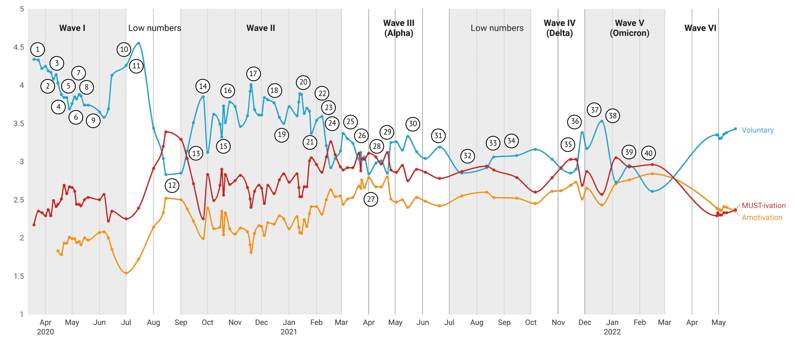

<style type="text/css">
body{
  font-size: 10pt;
}
p.comment {
background-color: #DBDBDB;
padding: 10px;
border: 1px solid black;
margin-left: 25px;
border-radius: 5px;
font-style: italic;
}
div.blue { background-color:#e6f0ff; border-radius: 5px; padding: 20px;}
div.orange { background-color:#ffa366; border-radius: 5px; padding: 20px;}
div.yellow { background-color:#09bb9f; color: white; border-radius: 5px; padding: 20px;}
div.grey { background-color:#ebebeb; color: white; border-radius: 5px; padding: 20px;}

</style>

<style>
  .col2 {
    columns: 2 200px;         /* number of columns and width in pixels*/
    -webkit-columns: 2 200px; /* chrome, safari */
    -moz-columns: 2 200px;    /* firefox */
  }
  .col3 {
    columns: 3 100px;
    -webkit-columns: 3 100px;
    -moz-columns: 3 100px;
  }
</style>

<!-- setwd('/Users/joachimwaterschoot/Library/CloudStorage/OneDrive-UGent/watjoa.github.io') -->


# Education <i class="fa fa-graduation-cap" aria-hidden="true"></i>
***

<div class = "row">
<div class = "col-md-2">
*2017 - current*
</div>
<div class = "col-md-7">
**PhD researcher in Developmental and Motivational Psychology**  
Thesis: The capacity of self-motivation: A multi-method investigation of the components, benefits and antecedents of motivational crafting.  
Supervisors: Prof. Maarten Vansteenkiste and Prof. Bart Soenens
</div>
<div class = "col-md-3">
<i class="fa fa-map-marker" aria-hidden="true"></i> Ghent University Ghent, Belgium.
</div>
</div>

<div class = "row">
<div class = "col-md-2">
*2017 - 2020*
</div>
<div class = "col-md-7">
**MSc in Statistical Data Analysis**  
Thesis: “It is not the quantity of motivation that matters”: a statistical comparison between Cluster analysis and Latent profile analysis  
Supervisors: Prof. Jan De Neve and Prof. Wim Beyers [Download <i class="fa fa-file-pdf-o" aria-hidden="true"></i>](download/sciencs/masterproeven/Waterschoot_Joachim_MaStat.pdf)
</div>
<div class = "col-md-3">
<i class="fa fa-map-marker" aria-hidden="true"></i> Ghent University Ghent, Belgium.
</div>
</div>

<div class = "row">
<div class = "col-md-2">
*2012 - 2017*
</div>
<div class = "col-md-7">
**MSc in Experimental and Theoretical Psychology**  
Thesis: Effect of Experimentally Induced Choice on Motivation in Middle Childhood: The Moderating Role of Teacher and Student Characteristics  
Supervisor: Prof. Bart Soenens [Download <i class="fa fa-file-pdf-o" aria-hidden="true"></i>](download/sciencs/masterproeven/Thesis_JoachimWaterschoot.pdf)  
  
Research internship: The Role of Competence-related Attentional Bias and Resilience in Restoring Thwarted Feelings of Competence at the Department of Developmental Psychology, Ghent University  
Supervisor: Prof. Maarten Vansteenkiste [Download <i class="fa fa-file-pdf-o" aria-hidden="true"></i>](download/sciencs/masterproeven/EPO_JoachimWaterschoot_01201353.pdf)
</div>
<div class = "col-md-3">
<i class="fa fa-map-marker" aria-hidden="true"></i> Ghent University Ghent, Belgium.
</div>
</div>


<br> 
<br> 

# Scientific Curriculum <i class="fa fa-clipboard" aria-hidden="true"></i>
***


```{r setup, include=FALSE}
knitr::opts_chunk$set(echo = TRUE)
library(tidyverse)
library(DT)
```

```{r data}
set.seed(42)
df <- readxl::read_excel('/Users/joachimwaterschoot/Downloads/test.xlsx')
df$ref <- as.character(df$ref)
df$journal <- as.character(df$journal)
df$end <- as.character(df$end)
df[is.na(df)] <- ""
df$reference <- paste(df$ref,df$journal,df$end,sep=" ")

df <- df[,c('lijst','reference','keyword','keyword2')]

```


## Publications

### 2022

<div class = "row">
<div class = "col-md-10">
20\. Morbée, S., Vansteenkiste, M., Waterschoot, J., Klein, O., Luminet, O., Schmitz, M., Van den Bergh, O., Van Oost, P., & Yzerbyt, V. **The Role of Communication Style and External Strategies in Predicting Vaccination Experiences and Intentions: An Experimental Vignette Study.** *Health Communication*, DOI: 10.1080/10410236.2022.2125012
</div>
<div class = "col-md-2">
[Download <i class="fa fa-file-pdf-o" aria-hidden="true"></i>](download/sciencs/studies/Published - The Role of Communication Style and External Motivators in Predicting Vaccination Experiences and Intentions An Experimental Vignette Study.pdf.pdf)
</div>
</div>

<div class = "row">
<div class = "col-md-10">
19\. Van de Casteele, M., Waterschoot, J., Anthierens, S., DeSmet, A., Galland, B., Goossens, H., Morbée, S. & Vansteenkiste, M. **Saliva Testing among Teachers during the COVID-19 Pandemic: Effects on Health Concerns, Well-being, and Behavior.** *Accepted in Social Science and Medicine.*
</div>
<div class = "col-md-2">
[Download not available yet]
</div>
</div>

<div class = "row">
<div class = "col-md-10">
18\. Morbée, S., Waterschoot, J., Yzerbyt, V., Klein, O., Luminet, O., Schmitz, M., Van den Bergh, O., Van Oost, P., De Craene, S., & Vansteenkiste, M. **Personal and Contextual Determinants of COVID-19 Vaccination Intention: A Vignette Study.** *Expert Review of Vaccines.* DOI: 10.1080/14760584.2022.2105212
</div>
<div class = "col-md-2">
[Download <i class="fa fa-file-pdf-o" aria-hidden="true"></i>](download/sciencs/studies/6bf4ef7e-6f91e-4512-8b9d-a71ae5f8700e.pdf)
</div>
</div>

<div class = "row">
<div class = "col-md-10">
17\. Waterschoot, J., Van Oost, P., Schmitz, M., Luminet, O., Klein, O., Morbée, S., Soenens, B., Van den Berg, O., Yzerbyt, V., & Vansteenkiste. **How Do Vaccination Intentions Change over Time? The Role of Motivational Growth.** *Health Psychology* 
</div>
<div class = "col-md-2">
[Download <i class="fa fa-file-pdf-o" aria-hidden="true"></i>](download/sciencs/studies/2022-98394-001.pdf)
</div>
</div>
  
<div class = "row">
<div class = "col-md-10">
16\. Waterschoot, J., Morbée, S., Vermote, B. et al. (2022). **Emotion regulation in times of COVID-19: A person- centered approach based on self-determination theory.** *Current Psychology.* 
</div>
<div class = "col-md-2">
[Download <i class="fa fa-file-pdf-o" aria-hidden="true"></i>](download/sciencs/studies/6bf4ef7e-691e-4512-8b9d-a71ae5f8700e.pdf)
</div>
</div>

<div class = "row">
<div class = "col-md-10">
15\. Waterschoot, J., Morbée, S., Van den Bergh, O., & Vansteenkiste, M. (2022). **Merry Christmas and a ‘Healthy’ New Year: Assessing people’s Expectations regarding Christmas Gathering in Pandemic Times.** *European Journal of Health Psychology.*
</div>
<div class = "col-md-2">
[Download <i class="fa fa-file-pdf-o" aria-hidden="true"></i>](download/sciencs/studies/2512-8442_a000114.pdf)   
</div>
</div>

<div class = "row">
<div class = "col-md-10">
14\. Van Oost, P., Yzerbyt, V., Schmitz, M., Vansteenkiste, M., Luminet, O., Morbée, S., ... & Klein, O. (2022). **The relation between conspiracism, government trust, and COVID-19 vaccination intentions: The key role of motivation.** *Social Science & Medicine,* 114926
</div>
<div class = "col-md-2">
[Download <i class="fa fa-file-pdf-o" aria-hidden="true"></i>](download/sciencs/studies/1-s2.0-S0277953622002325-main.pdf)   
</div>
</div>

<div class = "row">
<div class = "col-md-10">
13\. Psychological Science Accelerator Self-Determination Theory Collaboration (2022). **A global experiment on motivating social distancing during the COVID-19 pandemic.** *Proceedings of the National Academy of Sciences.*
</div>
<div class = "col-md-2">
[Download <i class="fa fa-file-pdf-o" aria-hidden="true"></i>](download/sciencs/studies/1-s2.0-S0277953622002325-main.pdf) | [Authorship letter <i class="fa fa-file-pdf-o" aria-hidden="true"></i>](download/sciencs/studies/Authorship_Letter_321.pdf)   
</div>
</div> 

<div class = "row">
<div class = "col-md-10">
12\. Brenning, K., Dieleman, L., Waterschoot, J., Morbée, S., Vermote, B., Soenens, B., Van der Kaap-Deeder, J., van den Bogaard, D., & Vansteenkiste, M. (2022). **Maladaptive Emotion Regulation as a Vulnerability Factor during the COVID-19 Pandemic: A 10-Wave Longitudinal Study.** *Accepted in Stress & Health*
</div>
<div class = "col-md-2">
 [Download not available yet]  
</div>
</div> 

<div class = "row">
<div class = "col-md-10">
11\. Wauters, A., Vervoort, T., Dhondt, K., Soenens, B., Vansteenkiste, M., Morbée, S., ... & Van Hoecke, E. (2022). **Mental health outcomes among parents of children with a chronic disease during the COVID-19 pandemic: The role of parental burn-out.** *Journal of Pediatric Psychology, 47*(4), 420-431.
</div>
<div class = "col-md-2">
[Download <i class="fa fa-file-pdf-o" aria-hidden="true"></i>](download/sciencs/studies/COVIDpaperWauetrs.pdf)
</div>
</div> 

<div class = "row">
<div class = "col-md-10">
10\. Schmitz, M., Luminet, O., Klein, O., Morbée, S., Van den Bergh, O., Van Oost, P., ... & Vansteenkiste, M. (2022). **Predicting vaccine uptake during COVID-19 crisis: A motivational approach.** *Vaccine, 40*(2), 288-297.
</div>
<div class = "col-md-2">
[Download <i class="fa fa-file-pdf-o" aria-hidden="true"></i>](download/sciencs/studies/1-s2.0-S0264410X21015425-main.pdf)
</div>
</div>     

### 2021

<div class = "row">
<div class = "col-md-10">
9\. Waterschoot, J., Van der Kaap-Deeder, J., Morbée, S., Soenens, B., & Vansteenkiste, M. (2021). **“How to unlock myself from boredom?” The role of mindfulness and a dual awareness-and action-oriented pathway during the COVID-19 lockdown.** *Personality and Individual Differences, *175, 110729.
</div>
<div class = "col-md-2">
[Download <i class="fa fa-file-pdf-o" aria-hidden="true"></i>](download/sciencs/studies/1-s2.0-S0191886921001045-main.pdf)
</div>
</div>  

<div class = "row">
<div class = "col-md-10">
8\. van der Kaap-Deeder, J., Vermote, B., Waterschoot, J., Soenens, B., Morbée, S., & Vansteenkiste, M. (2021). **The role of ego integrity and despair in older adults’ well-being during the COVID-19 crisis: the mediating role of need-based experiences.** *European Journal of Ageing, *1-13.
</div>
<div class = "col-md-2">
[Download <i class="fa fa-file-pdf-o" aria-hidden="true"></i>](download/sciencs/studies/VanDerKaap-Deeder2021_Article_TheRoleOfEgoIntegrityAndDespai.pdf)
</div>
</div>       

<div class = "row">
<div class = "col-md-10">
7\. Vermote, B., Waterschoot, J., Morbée, S. et al. (2012). **Do Psychological Needs Play a Role in Times of Uncertainty? Associations with Well-Being During the COVID-19 Crisis.** *Journal of Happiness Studies, 23, *257– 283.
</div>
<div class = "col-md-2">
[Download <i class="fa fa-file-pdf-o" aria-hidden="true"></i>](download/sciencs/studies/Vermote_et_al-2021-Journal_of_Happiness_Studies.pdf)
</div>
</div>       

<div class = "row">
<div class = "col-md-10">
6\. Morbée, S., Haerens, L., Waterschoot, J., & Vansteenkiste, M. (2021). **Which cyclists manage to cope with the corona crisis in a resilient way? The role of motivational profiles.** *International Journal of Sport and Exercise Psychology,* 1-19.
</div>
<div class = "col-md-2">
[Download <i class="fa fa-file-pdf-o" aria-hidden="true"></i>](download/sciencs/studies/sUc8WN-Which cyclists manage to cope with the corona crisis in a resilient way The role of motivational profiles.pdf)
</div>
</div>         

<div class = "row">
<div class = "col-md-10">
5\. Morbée, S., Vermote, B., Waterschoot, J., Dieleman, L., Soenens, B., Van den Bergh, O., Ryan, R. M., Vanhalst, J., De Muynck, G.-J., & Vansteenkiste, M. (2021). **Adherence to COVID-19 measures: The critical role of autonomous motivation on a short- and long-term basis.** *Motivation Science, 7*(4), 487–496.
</div>
<div class = "col-md-2">
[Download <i class="fa fa-file-pdf-o" aria-hidden="true"></i>](download/sciencs/studies/2021-95518-001.pdf)
</div>
</div>    

<div class = "row">
<div class = "col-md-10">
4\. Schrooyen, C., Soenens, B., Waterschoot, J., Vermote, B., Morbée, S., Beyers, W., Brenning, K., Dieleman, L., Van der Kaap-Deeder, J., & Vansteenkiste, M. (2021). **Parental identity as a resource for parental adaptation during the COVID-19 lockdown.** *Journal of Family Psychology, 35*(8), 1053-1064.
</div>
<div class = "col-md-2">
[Download <i class="fa fa-file-pdf-o" aria-hidden="true"></i>](download/sciencs/studies/2021-65223-001.pdf)
</div>
</div>        

### 2020

<div class = "row">
<div class = "col-md-10">
3\. Waterschoot, J., van der Kaap-Deeder, J., & Vansteenkiste, M. (2020). **The role of competence-related attentional bias and resilience in restoring thwarted feelings of competence.** *Motivation and Emotion, 44*(1), 82-98.
</div>
<div class = "col-md-2">
[Download <i class="fa fa-file-pdf-o" aria-hidden="true"></i>](download/sciencs/studies/Waterschoot2020_Article_TheRoleOfCompetence-relatedAtt.pdf)
</div>
</div>  

### 2019

<div class = "row">
<div class = "col-md-10">
2\. Waterschoot, J., Vansteenkiste, M., & Soenens, B. (2019). **The effects of experimentally induced choice on elementary school children’s intrinsic motivation: The moderating role of indecisiveness and teacher–student relatedness.** *Journal of experimental child psychology,*188, 104692.
</div>
<div class = "col-md-2">
[Download <i class="fa fa-file-pdf-o" aria-hidden="true"></i>](download/sciencs/studies/1-s2.0-S0022096519301110-main.pdf)
</div>
</div> 

<div class = "row">
<div class = "col-md-10">
1\. De Muynck, G. J., Soenens, B., Waterschoot, J., Degraeuwe, L., Broek, G. V., & Vansteenkiste, M. (2019). **Towards a more refined insight in the critical motivating features of choice: An experimental study among recreational rope skippers.** *Psychology of Sport and Exercise, 45,*101561
</div>
<div class = "col-md-2">
[Download <i class="fa fa-file-pdf-o" aria-hidden="true"></i>](download/barometer_material/1. Methodology.pdf)
</div>
</div>       

<br> 

## Chapters

<div class = "row">
<div class = "col-md-10">
Vansteenkiste, M., Soenens, B., & Waterschoot, J. (2018). **Catalyzing Intrinsic and Internalized Motivation: The Role of Basic Psychological Needs and Their Support.** In O'Donnell, A. et al. (Eds.), The Oxford Handbook of Educational Psychology. Oxford University Press. https://doi.org/10.1093/oxfordhb/9780199841332.013.41</div>
<div class = "col-md-2">
[Download not available]
</div>
</div>

<br>
 
## Public reports 

<center>
*Overview of motivation across the COVID-19 pandemic in Belgium with published reports.*

</center>

### 2022

<div class = "row">
<div class = "col-md-10">
40\. Motivation Barometer (1 February 2022). **The CST, vaccination obligation, 1G policy, or everything on the rocks?** (Report No. 40). Ghent, Leuven, Louvain, Bruxelles, Belgium. www.motivationbarometer.com
</div>
<div class = "col-md-2">
[NL <i class="fa fa-file-pdf-o" aria-hidden="true"></i>](download/reports/English/RAPPORT 1_ENG.pdf)
[FR <i class="fa fa-file-pdf-o" aria-hidden="true"></i>](download/reports/English/RAPPORT 1_ENG.pdf)
[ENG <i class="fa fa-file-pdf-o" aria-hidden="true"></i>](download/reports/English/RAPPORT 40_ENG.pdf) 
</div>
</div>

<div class = "row">
<div class = "col-md-10">
39\. Motivation Barometer (19 January 2022). **Motivation, well-being and vaccination attitudes in Omikron times** (Report No. 39). Ghent, Leuven, Louvain, Bruxelles, Belgium. www.motivationbarometer.com
</div>
<div class = "col-md-2">
[NL <i class="fa fa-file-pdf-o" aria-hidden="true"></i>](download/reports/English/RAPPORT 1_ENG.pdf)
[FR <i class="fa fa-file-pdf-o" aria-hidden="true"></i>](download/reports/English/RAPPORT 1_ENG.pdf)
[ENG <i class="fa fa-file-pdf-o" aria-hidden="true"></i>](download/reports/English/RAPPORT 39_ENG.pdf)
</div>
</div>

### 2021

<div class = "row">
<div class = "col-md-10">
38\. Motivation Barometer (21 December 2021). **Omicron, childhood vaccination and end-of-year celebrations: what do we think?** (Report No. 38). Ghent, Leuven, Louvain, Bruxelles, Belgium. www.motivationbarometer.com
</div>
<div class = "col-md-2">
[NL <i class="fa fa-file-pdf-o" aria-hidden="true"></i>](download/reports/English/RAPPORT 1_ENG.pdf)
[FR <i class="fa fa-file-pdf-o" aria-hidden="true"></i>](download/reports/English/RAPPORT 1_ENG.pdf)
[ENG <i class="fa fa-file-pdf-o" aria-hidden="true"></i>](download/reports/English/RAPPORT 38_ENG.pdf)
</div>
</div>

<div class = "row">
<div class = "col-md-10">
37\. Motivation Barometer (8 December 2021). **There is still support for the measures, but no longer for the corona policy** (Report No. 37). Ghent & Louvain, Belgium. www.motivationbarometer.com
</div>
<div class = "col-md-2">
[NL <i class="fa fa-file-pdf-o" aria-hidden="true"></i>](download/reports/English/RAPPORT 1_ENG.pdf)
[FR <i class="fa fa-file-pdf-o" aria-hidden="true"></i>](download/reports/English/RAPPORT 1_ENG.pdf)
[ENG <i class="fa fa-file-pdf-o" aria-hidden="true"></i>](download/reports/English/RAPPORT 37_ENG.pdf)
</div>
</div>

<div class = "row">
<div class = "col-md-10">
36\. Motivation Barometer (16 November 2021). **On the eve of stricter measures: Attitudes toward the new measures and the vaccine pass** (Report No. 36). Ghent & Louvain, Belgium. www.motivationbarometer.com
</div>
<div class = "col-md-2">
[NL <i class="fa fa-file-pdf-o" aria-hidden="true"></i>](download/reports/English/RAPPORT 1_ENG.pdf)
[FR <i class="fa fa-file-pdf-o" aria-hidden="true"></i>](download/reports/English/RAPPORT 1_ENG.pdf)
[ENG <i class="fa fa-file-pdf-o" aria-hidden="true"></i>](download/reports/English/RAPPORT 36_ENG.pdf)
</div>
</div>

<div class = "row">
<div class = "col-md-10">
35\. Motivation Barometer (12 November 2021). **How risk-aware and motivated is the population anymore and what is the role of the corona pass in this?** (Report No. 35). Ghent & Louvain, Belgium. www.motivationbarometer.com
</div>
<div class = "col-md-2">
[NL <i class="fa fa-file-pdf-o" aria-hidden="true"></i>](download/reports/English/RAPPORT 1_ENG.pdf)
[FR <i class="fa fa-file-pdf-o" aria-hidden="true"></i>](download/reports/English/RAPPORT 1_ENG.pdf)
[ENG <i class="fa fa-file-pdf-o" aria-hidden="true"></i>](download/reports/English/RAPPORT 35_ENG.pdf)
</div>
</div>

<div class = "row">
<div class = "col-md-10">
34\. Motivation Barometer (September 9, 2021). **Is there still motivational support for the measures in various regions?** (Report No. 34). Ghent & Louvain, Belgium. www.motivationbarometer.com
</div>
<div class = "col-md-2">
[NL <i class="fa fa-file-pdf-o" aria-hidden="true"></i>](download/reports/English/RAPPORT 1_ENG.pdf)
[FR <i class="fa fa-file-pdf-o" aria-hidden="true"></i>](download/reports/English/RAPPORT 1_ENG.pdf)
[ENG <i class="fa fa-file-pdf-o" aria-hidden="true"></i>](download/reports/English/RAPPORT 34_ENG.pdf)
</div>
</div>

<div class = "row">
<div class = "col-md-10">
33\. Motivation Barometer (August 17, 2021). **Update on vaccination, motivation and mental health during a transition phase.** (Report No. 33). Ghent & Louvain, Belgium. www.motivationbarometer.com
</div>
<div class = "col-md-2">
[NL <i class="fa fa-file-pdf-o" aria-hidden="true"></i>](download/reports/English/RAPPORT 1_ENG.pdf)
[FR <i class="fa fa-file-pdf-o" aria-hidden="true"></i>](download/reports/English/RAPPORT 1_ENG.pdf)
[ENG <i class="fa fa-file-pdf-o" aria-hidden="true"></i>](download/reports/English/RAPPORT 33_ENG.pdf)
</div>
</div>

<div class = "row">
<div class = "col-md-10">
32\. Motivation Barometer (July 14, 2021). **Obliging health professionals to be vaccinated: a good idea?** (Report No. 32). Ghent & Louvain, Belgium. www.motivationbarometer.com
</div>
<div class = "col-md-2">
[NL <i class="fa fa-file-pdf-o" aria-hidden="true"></i>](download/reports/English/RAPPORT 1_ENG.pdf)
[FR <i class="fa fa-file-pdf-o" aria-hidden="true"></i>](download/reports/English/RAPPORT 1_ENG.pdf)
[ENG <i class="fa fa-file-pdf-o" aria-hidden="true"></i>](download/reports/English/RAPPORT 32_ENG.pdf)
</div>
</div>

<div class = "row">
<div class = "col-md-10">
31\. Motivation Barometer (June 23, 2021). **Seduce, persuade and/or inform? How to deal with vaccine doubters?** (Report No. 31). Ghent & Louvain, Belgium. www.motivationbarometer.com
</div>
<div class = "col-md-2">
[NL <i class="fa fa-file-pdf-o" aria-hidden="true"></i>](download/reports/English/RAPPORT 1_ENG.pdf)
[FR <i class="fa fa-file-pdf-o" aria-hidden="true"></i>](download/reports/English/RAPPORT 1_ENG.pdf)
[ENG <i class="fa fa-file-pdf-o" aria-hidden="true"></i>](download/reports/English/RAPPORT 31_ENG.pdf)
</div>
</div>

<div class = "row">
<div class = "col-md-10">
30\. Motivation Barometer (May 10, 2021). **Update on vaccination, motivation, and mental health during a transitional phase** (Report No. 30). Ghent & Louvain, Belgium. www.motivationbarometer.com
</div>
<div class = "col-md-2">
[NL <i class="fa fa-file-pdf-o" aria-hidden="true"></i>](download/reports/English/RAPPORT 1_ENG.pdf)
[FR <i class="fa fa-file-pdf-o" aria-hidden="true"></i>](download/reports/English/RAPPORT 1_ENG.pdf)
[ENG <i class="fa fa-file-pdf-o" aria-hidden="true"></i>](download/reports/English/RAPPORT 30_ENG.pdf)
</div>
</div>

<div class = "row">
<div class = "col-md-10">
29\. Motivation Barometer (April 20, 2021). **Does the prospect of feedbacks motivate the population?** (Report No. 29). Ghent & Louvain, Belgium.www.motivationbarometer.com
</div>
<div class = "col-md-2">
[NL <i class="fa fa-file-pdf-o" aria-hidden="true"></i>](download/reports/English/RAPPORT 1_ENG.pdf)
[FR <i class="fa fa-file-pdf-o" aria-hidden="true"></i>](download/reports/English/RAPPORT 1_ENG.pdf)
[ENG <i class="fa fa-file-pdf-o" aria-hidden="true"></i>](download/reports/English/RAPPORT 29_ENG.pdf)
</div>
</div>

<div class = "row">
<div class = "col-md-10">
28\. Motivation Barometer (April 6, 2021). **Vaccination: preferences become clear!** (Report No. 28). Ghent & Louvain, Belgium. www.motivationbarometer.com
</div>
<div class = "col-md-2">
[NL <i class="fa fa-file-pdf-o" aria-hidden="true"></i>](download/reports/English/RAPPORT 1_ENG.pdf)
[FR <i class="fa fa-file-pdf-o" aria-hidden="true"></i>](download/reports/English/RAPPORT 1_ENG.pdf)
[ENG <i class="fa fa-file-pdf-o" aria-hidden="true"></i>](download/reports/English/RAPPORT 28_ENG.pdf)
</div>
</div>

<div class = "row">
<div class = "col-md-10">
27\. Motivation Barometer (April 1, 2021). **Saliva testing in schools: impact on mental health, motivation and behavior** (Report No. 27). Ghent & Louvain, Belgium. www.motivationbarometer.com
</div>
<div class = "col-md-2">
[NL <i class="fa fa-file-pdf-o" aria-hidden="true"></i>](download/reports/English/RAPPORT 1_ENG.pdf)
[FR <i class="fa fa-file-pdf-o" aria-hidden="true"></i>](download/reports/English/RAPPORT 1_ENG.pdf)
[ENG <i class="fa fa-file-pdf-o" aria-hidden="true"></i>](download/reports/English/RAPPORT 27_ENG.pdf)
</div>
</div>

<div class = "row">
<div class = "col-md-10">
26\. Motivation Barometer (March 24, 2021). **Is there motivational willingness for stricter measures?** (Report No. 26). Ghent & Louvain, Belgium. www.motivationbarometer.com
</div>
<div class = "col-md-2">
[NL <i class="fa fa-file-pdf-o" aria-hidden="true"></i>](download/reports/English/RAPPORT 1_ENG.pdf)
[FR <i class="fa fa-file-pdf-o" aria-hidden="true"></i>](download/reports/English/RAPPORT 1_ENG.pdf)
[ENG <i class="fa fa-file-pdf-o" aria-hidden="true"></i>](download/reports/English/RAPPORT 26_ENG.pdf)
</div>
</div>

<div class = "row">
<div class = "col-md-10">
25\. Motivation Barometer (March 2, 2021). **The corona numbers: motivation matters!** (Report No. 25). Ghent & Louvain, Belgium. www.motivationbarometer.com
</div>
<div class = "col-md-2">
[NL <i class="fa fa-file-pdf-o" aria-hidden="true"></i>](download/reports/English/RAPPORT 1_ENG.pdf)
[FR <i class="fa fa-file-pdf-o" aria-hidden="true"></i>](download/reports/English/RAPPORT 1_ENG.pdf)
[ENG <i class="fa fa-file-pdf-o" aria-hidden="true"></i>](download/reports/English/RAPPORT 25_ENG.pdf)
</div>
</div>

<div class = "row">
<div class = "col-md-10">
24\. Motivation Barometer (February 14, 2021). **How can we reinvigorate motivation?** (Report No. 24). Ghent, Belgium. www.motivationbarometer.com
</div>
<div class = "col-md-2">
[NL <i class="fa fa-file-pdf-o" aria-hidden="true"></i>](download/reports/English/RAPPORT 1_ENG.pdf)
[FR <i class="fa fa-file-pdf-o" aria-hidden="true"></i>](download/reports/English/RAPPORT 1_ENG.pdf)
[ENG <i class="fa fa-file-pdf-o" aria-hidden="true"></i>](download/reports/English/RAPPORT 24_ENG.pdf)
</div>
</div>

<div class = "row">
<div class = "col-md-10">
23\. Motivation Barometer (February 11, 2021). **(Re)building trust: vaccination and the actors of the pandemic** (Report No. 23). Ghent, Belgium. www.motivationbarometer.com
</div>
<div class = "col-md-2">
[NL <i class="fa fa-file-pdf-o" aria-hidden="true"></i>](download/reports/English/RAPPORT 1_ENG.pdf)
[FR <i class="fa fa-file-pdf-o" aria-hidden="true"></i>](download/reports/English/RAPPORT 1_ENG.pdf)
[ENG <i class="fa fa-file-pdf-o" aria-hidden="true"></i>](download/reports/English/RAPPORT 23_ENG.pdf)
</div>
</div>

<div class = "row">
<div class = "col-md-10">
22\. Motivation Barometer (February 5, 2021). **Movement as a source of well-being** (Report No. 22). Ghent, Belgium. www.motivationbarometer.com
</div>
<div class = "col-md-2">
[NL <i class="fa fa-file-pdf-o" aria-hidden="true"></i>](download/reports/English/RAPPORT 1_ENG.pdf)
[FR <i class="fa fa-file-pdf-o" aria-hidden="true"></i>](download/reports/English/RAPPORT 1_ENG.pdf)
[ENG <i class="fa fa-file-pdf-o" aria-hidden="true"></i>](download/reports/English/RAPPORT 22_ENG.pdf)
</div>
</div>

<div class = "row">
<div class = "col-md-10">
21\. Motivation Barometer (January 29, 2021). **At our limits end and yet persevering** (Report No. 21). Ghent, Belgium. www.motivationbarometer.com
</div>
<div class = "col-md-2">
[NL <i class="fa fa-file-pdf-o" aria-hidden="true"></i>](download/reports/English/RAPPORT 1_ENG.pdf)
[FR <i class="fa fa-file-pdf-o" aria-hidden="true"></i>](download/reports/English/RAPPORT 1_ENG.pdf)
[ENG <i class="fa fa-file-pdf-o" aria-hidden="true"></i>](download/reports/English/RAPPORT 21_ENG.pdf)
</div>
</div>

<div class = "row">
<div class = "col-md-10">
20\. Motivation Barometer (January 15, 2021). **What are the psychological conditions to vaccination?** (Report No. 20). Ghent, Belgium. www.motivationbarometer.com
</div>
<div class = "col-md-2">
[NL <i class="fa fa-file-pdf-o" aria-hidden="true"></i>](download/reports/English/RAPPORT 1_ENG.pdf)
[FR <i class="fa fa-file-pdf-o" aria-hidden="true"></i>](download/reports/English/RAPPORT 1_ENG.pdf)
[ENG <i class="fa fa-file-pdf-o" aria-hidden="true"></i>](download/reports/English/RAPPORT 20_ENG.pdf)
</div>
</div>

### 2020

<div class = "row">
<div class = "col-md-10">
19\. Motivation Barometer (December 23, 2020). **Christmas 2020** (Report No. 19). Ghent, Belgium. www.motivationbarometer.com
</div>
<div class = "col-md-2">
[NL <i class="fa fa-file-pdf-o" aria-hidden="true"></i>](download/reports/English/RAPPORT 1_ENG.pdf)
[FR <i class="fa fa-file-pdf-o" aria-hidden="true"></i>](download/reports/English/RAPPORT 1_ENG.pdf)
[ENG <i class="fa fa-file-pdf-o" aria-hidden="true"></i>](download/reports/English/RAPPORT 19_ENG.pdf)
</div>
</div>

<div class = "row">
<div class = "col-md-10">
18\. Motivation Barometer (December 14, 2020). **Vaccination willingness and motivation** (Report No. 18). Ghent, Belgium. www.motivationbarometer.com
</div>
<div class = "col-md-2">
[NL <i class="fa fa-file-pdf-o" aria-hidden="true"></i>](download/reports/English/RAPPORT 1_ENG.pdf)
[FR <i class="fa fa-file-pdf-o" aria-hidden="true"></i>](download/reports/English/RAPPORT 1_ENG.pdf)
[ENG <i class="fa fa-file-pdf-o" aria-hidden="true"></i>](download/reports/English/RAPPORT 18_ENG.pdf)
</div>
</div>

<div class = "row">
<div class = "col-md-10">
17\. Motivation Barometer (23 November 2020). **What makes for a happy Christmas in 2020?** (Report No. 17). Gent, Belgium. www.motivationbarometer.com
</div>
<div class = "col-md-2">
[NL <i class="fa fa-file-pdf-o" aria-hidden="true"></i>](download/reports/English/RAPPORT 1_ENG.pdf)
[FR <i class="fa fa-file-pdf-o" aria-hidden="true"></i>](download/reports/English/RAPPORT 1_ENG.pdf)
[ENG <i class="fa fa-file-pdf-o" aria-hidden="true"></i>](download/reports/English/RAPPORT 17_ENG.pdf)
</div>
</div>

<div class = "row">
<div class = "col-md-10">
16\. Motivation Barometer (October 27, 2020). **Taking a closer look at some assumptions about behavior and motivation** (Report No. 16). Ghent, Belgium. www.motivationbarometer.com
</div>
<div class = "col-md-2">
[NL <i class="fa fa-file-pdf-o" aria-hidden="true"></i>](download/reports/English/RAPPORT 1_ENG.pdf)
[FR <i class="fa fa-file-pdf-o" aria-hidden="true"></i>](download/reports/English/RAPPORT 1_ENG.pdf)
[ENG <i class="fa fa-file-pdf-o" aria-hidden="true"></i>](download/reports/English/RAPPORT 16_ENG.pdf)
</div>
</div>

<div class = "row">
<div class = "col-md-10">
15\. Motivation Barometer (October 14, 2020). **Even hard nuts can be cracked in a motivational way!** (Report No. 15). Ghent, Belgium. www.motivationbarometer.com
</div>
<div class = "col-md-2">
[NL <i class="fa fa-file-pdf-o" aria-hidden="true"></i>](download/reports/English/RAPPORT 1_ENG.pdf)
[FR <i class="fa fa-file-pdf-o" aria-hidden="true"></i>](download/reports/English/RAPPORT 1_ENG.pdf)
[ENG <i class="fa fa-file-pdf-o" aria-hidden="true"></i>](download/reports/English/RAPPORT 15_ENG.pdf)
</div>
</div>

<div class = "row">
<div class = "col-md-10">
14\. Motivation Barometer (September 30, 2020). **What do citizens think of coronabadges and the -barometer? A closer look at some motivational tools** (Report No. 14). Ghent, Belgium. www.motivationbarometer.com
</div>
<div class = "col-md-2">
[NL <i class="fa fa-file-pdf-o" aria-hidden="true"></i>](download/reports/English/RAPPORT 1_ENG.pdf)
[FR <i class="fa fa-file-pdf-o" aria-hidden="true"></i>](download/reports/English/RAPPORT 1_ENG.pdf)
[ENG <i class="fa fa-file-pdf-o" aria-hidden="true"></i>](download/reports/English/RAPPORT 14_ENG.pdf)
</div>
</div>

<div class = "row">
<div class = "col-md-10">
13\. Motivation Barometer (September 17, 2020). **What do people think are meaningful alternatives to the current bubble concept? The psychological effects of flex bubbles and a social carte blanche compared** (Report No. 13). Ghent, Belgium. www.motivationbarometer.com
</div>
<div class = "col-md-2">
[NL <i class="fa fa-file-pdf-o" aria-hidden="true"></i>](download/reports/English/RAPPORT 1_ENG.pdf)
[FR <i class="fa fa-file-pdf-o" aria-hidden="true"></i>](download/reports/English/RAPPORT 1_ENG.pdf)
[ENG <i class="fa fa-file-pdf-o" aria-hidden="true"></i>](download/reports/English/RAPPORT 13_ENG.pdf)
</div>
</div>

<div class = "row">
<div class = "col-md-10">
12\. Motivation Barometer (August 19, 2020). **The population is no longer motivated. How can we create a motivational framework** (Report No. 12). Ghent, Belgium. www.motivationbarometer.com
</div>
<div class = "col-md-2">
[NL <i class="fa fa-file-pdf-o" aria-hidden="true"></i>](download/reports/English/RAPPORT 1_ENG.pdf)
[FR <i class="fa fa-file-pdf-o" aria-hidden="true"></i>](download/reports/English/RAPPORT 1_ENG.pdf)
[ENG <i class="fa fa-file-pdf-o" aria-hidden="true"></i>](download/reports/English/RAPPORT 12_ENG.pdf)
</div>
</div>

<div class = "row">
<div class = "col-md-10">
11\. Motivation Barometer (July 16, 2020). **How to maintain high motivation for tracking during this summertime? The role of risk perception, fear, and obligation** (Report No. 11). Ghent, Belgium. www.motivationbarometer.com
</div>
<div class = "col-md-2">
[NL <i class="fa fa-file-pdf-o" aria-hidden="true"></i>](download/reports/English/RAPPORT 1_ENG.pdf)
[FR <i class="fa fa-file-pdf-o" aria-hidden="true"></i>](download/reports/English/RAPPORT 1_ENG.pdf)
[ENG <i class="fa fa-file-pdf-o" aria-hidden="true"></i>](download/reports/English/RAPPORT 11_ENG.pdf)
</div>
</div>

<div class = "row">
<div class = "col-md-10">
10\. Motivation Barometer (July 1, 2020). **What makes for an invigorating and rewarding summer vacation in corona times?** (Report No. 10). Ghent, Belgium. www.motivationbarometer.com
</div>
<div class = "col-md-2">
[NL <i class="fa fa-file-pdf-o" aria-hidden="true"></i>](download/reports/English/RAPPORT 1_ENG.pdf)
[FR <i class="fa fa-file-pdf-o" aria-hidden="true"></i>](download/reports/English/RAPPORT 1_ENG.pdf)
[ENG <i class="fa fa-file-pdf-o" aria-hidden="true"></i>](download/reports/English/RAPPORT 10_ENG.pdf)
</div>
</div>

<div class = "row">
<div class = "col-md-10">
9\. Motivation Barometer (May 19, 2020). **Discomforts of face masks: how we wear them with a smile by encouraging voluntary responsibility** (Report No. 9). Ghent, Belgium. www.motivationbarometer.com
</div>
<div class = "col-md-2">
[NL <i class="fa fa-file-pdf-o" aria-hidden="true"></i>](download/reports/English/RAPPORT 1_ENG.pdf)
[FR <i class="fa fa-file-pdf-o" aria-hidden="true"></i>](download/reports/English/RAPPORT 1_ENG.pdf)
[ENG <i class="fa fa-file-pdf-o" aria-hidden="true"></i>](download/reports/English/RAPPORT 9_ENG.pdf)
</div>
</div>

<div class = "row">
<div class = "col-md-10">
8\. Motivation Barometer (May 14, 2020). **Student years are the time of your life! Even during corona?** (Report No. 8). Ghent, Belgium. www.motivationbarometer.com
</div>
<div class = "col-md-2">
[NL <i class="fa fa-file-pdf-o" aria-hidden="true"></i>](download/reports/English/RAPPORT 1_ENG.pdf)
[FR <i class="fa fa-file-pdf-o" aria-hidden="true"></i>](download/reports/English/RAPPORT 1_ENG.pdf)
[ENG <i class="fa fa-file-pdf-o" aria-hidden="true"></i>](download/reports/English/RAPPORT 8_ENG.pdf)
</div>
</div>

<div class = "row">
<div class = "col-md-10">
7\. Motivation Barometer (May 12, 2020). **Does ‘bubbling’ on Mother’s Day boost our connectedness and motivation?** (Report No. 7). Ghent, Belgium. www.motivationbarometer.com
</div>
<div class = "col-md-2">
[NL <i class="fa fa-file-pdf-o" aria-hidden="true"></i>](download/reports/English/RAPPORT 1_ENG.pdf)
[FR <i class="fa fa-file-pdf-o" aria-hidden="true"></i>](download/reports/English/RAPPORT 1_ENG.pdf)
[ENG <i class="fa fa-file-pdf-o" aria-hidden="true"></i>](download/reports/English/RAPPORT 7_ENG.pdf)
</div>
</div>

<div class = "row">
<div class = "col-md-10">
6\. Motivation Barometer (May 5, 2020). **Motivation rises slightly. Government continue the positive momentum of motivational communication!** (Report No. 6). Ghent, Belgium. www.motivationbarometer.com
</div>
<div class = "col-md-2">
[NL <i class="fa fa-file-pdf-o" aria-hidden="true"></i>](download/reports/English/RAPPORT 1_ENG.pdf)
[FR <i class="fa fa-file-pdf-o" aria-hidden="true"></i>](download/reports/English/RAPPORT 1_ENG.pdf)
[ENG <i class="fa fa-file-pdf-o" aria-hidden="true"></i>](download/reports/English/RAPPORT 6_ENG.pdf)
</div>
</div>

<div class = "row">
<div class = "col-md-10">
5\. Motivation Barometer (April 26, 2020). **Fatigue during the collective marathon strikes. Evolutions in motivation, mental health and (de)motivating government communication** (Report No. 5). Ghent, Belgium. www.motivationbarometer.com
</div>
<div class = "col-md-2">
[NL <i class="fa fa-file-pdf-o" aria-hidden="true"></i>](download/reports/English/RAPPORT 1_ENG.pdf)
[FR <i class="fa fa-file-pdf-o" aria-hidden="true"></i>](download/reports/English/RAPPORT 1_ENG.pdf)
[ENG <i class="fa fa-file-pdf-o" aria-hidden="true"></i>](download/reports/English/RAPPORT 5_ENG.pdf)
</div>
</div>

<div class = "row">
<div class = "col-md-10">
4\. Motivation Barometer (April 21, 2020). **Motivational willingness for the public marathon is dwindling: the leadership compass as a guide to motivational communication** (Report No. 4). Ghent, Belgium. www.motivationbarometer.com
</div>
<div class = "col-md-2">
[NL <i class="fa fa-file-pdf-o" aria-hidden="true"></i>](download/reports/English/RAPPORT 1_ENG.pdf)
[FR <i class="fa fa-file-pdf-o" aria-hidden="true"></i>](download/reports/English/RAPPORT 1_ENG.pdf)
[ENG <i class="fa fa-file-pdf-o" aria-hidden="true"></i>](download/reports/English/RAPPORT 4_ENG.pdf)
</div>
</div>

<div class = "row">
<div class = "col-md-10">
3\. Motivation Barometer (April 14, 2020). **Psychological vitamins in times of corona fatigue** (Report No. 3). Ghent, Belgium. www.motivationbarometer.com
</div>
<div class = "col-md-2">
[NL <i class="fa fa-file-pdf-o" aria-hidden="true"></i>](download/reports/English/RAPPORT 1_ENG.pdf)
[FR <i class="fa fa-file-pdf-o" aria-hidden="true"></i>](download/reports/English/RAPPORT 1_ENG.pdf)
[ENG <i class="fa fa-file-pdf-o" aria-hidden="true"></i>](download/reports/English/RAPPORT 3_ENG.pdf)
</div>
</div>

<div class = "row">
<div class = "col-md-10">
2\. Motivation Barometer (April 8, 2020). **Is our motivation to adhere to the measures flattening? The importance of clear and logical communication** (Report No. 2). Ghent, Belgium. www.motivationbarometer.com
</div>
<div class = "col-md-2">
[NL <i class="fa fa-file-pdf-o" aria-hidden="true"></i>](download/reports/English/RAPPORT 1_ENG.pdf)
[FR <i class="fa fa-file-pdf-o" aria-hidden="true"></i>](download/reports/English/RAPPORT 1_ENG.pdf)
[ENG <i class="fa fa-file-pdf-o" aria-hidden="true"></i>](download/reports/English/RAPPORT 2_ENG.pdf)
</div>
</div>

<div class = "row">
<div class = "col-md-10">
1\. Motivation Barometer (March 30, 2020). **How long will we hold on to these measures? Our motivation is strong at the moment!** (Report No. 1). Ghent, Belgium. www.motivationbarometer.com
</div>
<div class = "col-md-2">
[NL <i class="fa fa-file-pdf-o" aria-hidden="true"></i>](download/reports/English/RAPPORT 1_ENG.pdf)
[FR <i class="fa fa-file-pdf-o" aria-hidden="true"></i>](download/reports/English/RAPPORT 1_ENG.pdf)
[ENG <i class="fa fa-file-pdf-o" aria-hidden="true"></i>](download/reports/English/RAPPORT 1_ENG.pdf)
</div>
</div>

<br> 

## Conference proceedings

### 2019

<div class = "row">
<div class = "col-md-6">
9\. Waterschoot, J., Vansteenkiste, M., & Soenens, B. (2019, May). **Life ain’t no ponyfarm: examining the effectiveness of different self-motivating strategies when facing boring activites.**
</div>
<div class = "col-md-4">
Poster presented at the SDT conference.<br> <i class="fa fa-map-marker" aria-hidden="true"></i>  Egmond aan Zee, The Netherlands.
</div>
<div class = "col-md-2">
[Abstract <i class="fa fa-file-word-o" aria-hidden="true"></i>](download/presentations/Abstract_SDT_2019.docx) | [Notification letter <i class="fa fa-file-pdf-o" aria-hidden="true"></i>](download/presentations/Notification letter SDT 2019.pdf)
</div>
</div>

<div class = "row">
<div class = "col-md-6">
8\. Waterschoot, J., Vansteenkiste, M., Verscheuren, K., & Soenens, B. (2019, August). **Towards a refined insight in the shifts in adolescents’ motivational profiles: A longitudinal study.**
</div>
<div class = "col-md-4">
Paper presented at the EARLI conference.<br> <i class="fa fa-map-marker" aria-hidden="true"></i> Aachen, Germany.
</div>
<div class = "col-md-2">
[Abstract <i class="fa fa-file-pdf-o" aria-hidden="true"></i>](download/presentations/Abstract_EARLI_final_ed.pdf) | [Extended Abstract <i class="fa fa-file-pdf-o" aria-hidden="true"></i>](download/presentations/Abstract_EARLI_extended.pdf)
</div>
</div>

<div class = "row">
<div class = "col-md-6">
7\. Waterschoot, J., Vansteenkiste, M., Verscheuren, K., & Soenens, B. (2019, September). **Towards a refined insight in the shifts in adolescents’ motivational profiles: A longitudinal study.**
</div>
<div class = "col-md-4">
Paper presented at the European Conference of Developmental Psychology.<br> <i class="fa fa-map-marker" aria-hidden="true"></i> Athene, Greece.
</div>
<div class = "col-md-2">
[Presentation <i class="fa fa-file-powerpoint-o" aria-hidden="true"></i>](download/presentations/Presentation_EARA18_Resilience.key)
</div>
</div>

### 2018

<div class = "row">
<div class = "col-md-6">
6\. Waterschoot, J., Soenens, B., & Vansteenkiste, M. (2018, July). **Effects of Experimentally Induced Choice on Intrinsic Motivation in Middle Childhood.**
</div>
<div class = "col-md-4">
Paper presented at the JURE Conference 2018 at University of Antwerp. <br> <i class="fa fa-map-marker" aria-hidden="true"></i> Antwerp, Belgium.
</div>
<div class = "col-md-2">
[Presentation <i class="fa fa-file-pdf-o" aria-hidden="true"></i>](download/presentations/Presentation_JURE_050718.pdf) | [Abstract <i class="fa fa-file-pdf-o" aria-hidden="true"></i>](download/presentations/Abstract_Choice_JURE_Antwerp.pdf)
</div>
</div>

<div class = "row">
<div class = "col-md-6">
5\. Waterschoot, J., Van-der Kaap Deeder, J., & Vansteenkiste, M. (2018, August). **How do People Handle Competence Frustration?: The Role of Resilience and Attentional Bias.**
</div>
<div class = "col-md-4">
Paper presented at the International Conference on Motivation (ICM) at the Aarhus University. <br> <i class="fa fa-map-marker" aria-hidden="true"></i> Aarhus, Denmark.
</div>
<div class = "col-md-2">
[Presentation <i class="fa fa-file-powerpoint-o" aria-hidden="true"></i>](download/presentations/Presentation_ICM18_Resilience.key) | [Abstract <i class="fa fa-file-word-o" aria-hidden="true"></i>](download/presentations/Abstract_ResilienceAB_Denmark.docx)
</div>
</div>

<div class = "row">
<div class = "col-md-6">
4\. Waterschoot, J., Soenens, B., & Vansteenkiste, M. (2018, August). **Effects of Experimentally Induced Choice on Intrinsic Motivation in Middle Childhood.**
</div>
<div class = "col-md-4">
Paper presented at the International Conference on Motivation (ICM) at the Aarhus University. <br> <i class="fa fa-map-marker" aria-hidden="true"></i> Aarhus Denmark.
</div>
<div class = "col-md-2">
[Presentation <i class="fa fa-file-powerpoint-o" aria-hidden="true"></i>](download/presentations/Presentation_ICM18_Choice.key) | [Abstract <i class="fa fa-file-word-o" aria-hidden="true"></i>](download/presentations/Abstract_Choice_Denmark.docx)
</div>
</div>

<div class = "row">
<div class = "col-md-6">
3\. Aelterman, N., Soenens, B., Vansteenkiste, M., Waterschoot, J., & Haerens, L. (2018, August). **Effects of Teachers’ Style of Rule Setting on Students’ Psychological: Needs and Behavioral Responses.**
</div>
<div class = "col-md-4">
Paper presented at the International Conference on Motivation (ICM) at the Aarhus University. <br> <i class="fa fa-map-marker" aria-hidden="true"></i> Aarhus Denmark.
</div>
<div class = "col-md-2">
[Download not available]
</div>
</div>

<div class = "row">
<div class = "col-md-6">
2\. Waterschoot, J., Van-der Kaap Deeder, J., & Vansteenkiste, M. (2018, September). **The Role of Competence-related Attentional Bias and Resilience in Restoring Thwarted Feelings of Competence.**
</div>
<div class = "col-md-4">
Paper presented at the EARA congress at Ghent University. <br> <i class="fa fa-map-marker" aria-hidden="true"></i> Ghent, Belgium
</div>
<div class = "col-md-2">
[Presentation <i class="fa fa-file-powerpoint-o" aria-hidden="true"></i>](download/presentations/Presentation_EARA18_Resilience.key)
</div>
</div>

<div class = "row">
<div class = "col-md-6">
1\. Vandenkerckhove, B., Soenens, B., Nasso, S., Waterschoot, J., De Raedt, R., Luyten, P., & Vansteenkiste, M. (2018, July). **Effects of social rejection in dependent individuals: an experimental study with the cyberball paradigm.**
</div>
<div class = "col-md-4">
Poster presented at the ISSBD Conference (International Society for the Study of Behavioural Development).<br> <i class="fa fa-map-marker" aria-hidden="true"></i> Gold Coast, Australia.
</div>
<div class = "col-md-2">
[Download not available]
</div>
</div>

<br> 
<br> 

# Teaching <i class="fa fa-users" aria-hidden="true"></i>
***

## Experience

<div class = "row">
<div class = "col-md-2">
*2020 - current*
</div>
<div class = "col-md-7">
**Motivation Psychology**: Lecture on Interest Theory   
Educational Master 
</div>
<div class = "col-md-3">
<i class="fa fa-map-marker" aria-hidden="true"></i> Ghent University Ghent, Belgium.
</div>
</div>

<div class = "row">
<div class = "col-md-2">
*2017 - current*
</div>
<div class = "col-md-7">
**Academic Skills**: Supervision, teaching and evaluation of the courses  
2nd Bachelor, Psychology 
</div>
<div class = "col-md-3">
<i class="fa fa-map-marker" aria-hidden="true"></i> Ghent University Ghent, Belgium.
</div>
</div>

<div class = "row">
<div class = "col-md-2">
*2017 - current*
</div>
<div class = "col-md-7">
**Psychology of the Lifespan**: assigments evaluation of the course  
3d Bachelor, Psychology 
</div>
<div class = "col-md-3">
<i class="fa fa-map-marker" aria-hidden="true"></i> Ghent University Ghent, Belgium.
</div>
</div>

<div class = "row">
<div class = "col-md-2">
*2019 - current*
</div>
<div class = "col-md-7">
**Developmental Psychology**: supervision, organizing, teaching and evaluating of practical sessions and examination of the course.  
1st Bachelor, Psychology and 2nd Bachelor, Educational Sciences 
</div>
<div class = "col-md-3">
<i class="fa fa-map-marker" aria-hidden="true"></i> Ghent University Ghent, Belgium.
</div>
</div>

<div class = "row">
<div class = "col-md-2">
*2017 - 2018*
</div>
<div class = "col-md-7">
**Recent Theories on Developmental Psychology**: supervision, organizing, teaching and evaluating of practical sessions and examination of the course.  
2nd Bachelor, Psychology
</div>
<div class = "col-md-3">
<i class="fa fa-map-marker" aria-hidden="true"></i> Ghent University Ghent, Belgium.
</div>
</div>

## Lectures  

<div class = "row">
<div class = "col-md-2">
*07/06/2022*
</div>
<div class = "col-md-7">
Presentation on Methods, Motivation Barometer, Interdisciplinary Symposium
</div>
<div class = "col-md-3">
<i class="fa fa-map-marker" aria-hidden="true"></i> KVAB, Brussels, Belgium
</div>
</div>

<div class = "row">
<div class = "col-md-2">
*7-9/12/2021*
</div>
<div class = "col-md-7">
'De Belgische bevolking als leerling in de klas: de uitdagingen voor de overheid als leerkracht tijdens COVID-19', studiedag.
</div>
<div class = "col-md-3">
<i class="fa fa-map-marker" aria-hidden="true"></i> Arteveldehogeschool, Ghent, Belgium
</div>
</div>

<div class = "row">
<div class = "col-md-2">
*09/02/2021*
</div>
<div class = "col-md-7">
gastcollege 'de motivatiebarometer', studiedag.
</div>
<div class = "col-md-3">
<i class="fa fa-map-marker" aria-hidden="true"></i> VIVES hogeschool, Kortrijk, Belgium
</div>
</div>

<div class = "row">
<div class = "col-md-2">
*10/12/2020*
</div>
<div class = "col-md-7">
'De Belgische bevolking als leerling in de klas: de uitdagingen voor de overheid als leerkracht tijdens COVID-19', studiedag.
</div>
<div class = "col-md-3">
<i class="fa fa-map-marker" aria-hidden="true"></i> Arteveldehogeschool, Kortrijk, Belgium
</div>
</div>

<div class = "row">
<div class = "col-md-2">
*05/03/2020*
</div>
<div class = "col-md-7">
'Wanneer de mentale brandstof de motor doet wandelen: presentatie Dodentochtstudie', open publiek.
</div>
<div class = "col-md-3">
<i class="fa fa-map-marker" aria-hidden="true"></i> Ghent University, Ghent, Belgium. 
</div>
</div>

<div class = "row">
<div class = "col-md-2">
*11/02/2020*
</div>
<div class = "col-md-7">
'Wanneer de mentale brandstof de motor doet wandelen: presentatie Dodentochtstudie op de werkvloer', HR groep.
</div>
<div class = "col-md-3">
<i class="fa fa-map-marker" aria-hidden="true"></i> Kortrijk, Belgium. 
</div>
</div>

<div class = "row">
<div class = "col-md-2">
*15/10/2019*
</div>
<div class = "col-md-7">
Lecture on 'An integrative overview of motivation'.
</div>
<div class = "col-md-3">
<i class="fa fa-map-marker" aria-hidden="true"></i> The Hult International Business School, London, UK. 
</div>
</div>

<div class = "row">
<div class = "col-md-2">
*20/03/2018*
</div>
<div class = "col-md-7">
'Motivation from a Self-Determination theory perspective', students, teachers and parents.
</div>
<div class = "col-md-3">
<i class="fa fa-map-marker" aria-hidden="true"></i> Da Vinci Campus, Ronse, Belgium. 
</div>
</div>

<div class = "row">
<div class = "col-md-2">
*12/03/2015*
</div>
<div class = "col-md-7">
'A Choice Experiment among elementary school children', students Occupational Science.
</div>
<div class = "col-md-3">
<i class="fa fa-map-marker" aria-hidden="true"></i> Artevelde School, Ghent, Belgium. 
</div>
</div>

<br> 
<br> 

## Master theses supervision

### Current

<div class = "row">
<div class = "col-md-10">
25\. Marie Vankeirsbilck (current). **Hoe is de motivatie en het psychologisch welzijn bij studenten geëvolueerd tussen 2020 (pre-corona) en 2022 (post-corona)?** *Niet-gepubliceerde Master Thesis, Universiteit Gent. (Promotor: M. Vansteenkiste)*
</div>
<div class = "col-md-2">
[In progress]
</div>
</div>  

<div class = "row">
<div class = "col-md-10">
24\. Dimitri Sevens (current). **“Hoe kan ik mezelf motiveren?” De ontwikkeling van een interventie in een studentenpopulatie.** *Niet-gepubliceerde Master Thesis, Universiteit Gent. (Promotor: M. Vansteenkiste)*
</div>
<div class = "col-md-2">
[In progress]
</div>
</div>  

<div class = "row">
<div class = "col-md-10">
23\. Peeters, Pieter (current). **Heeft het begin van de coronacrisis geleid tot een verandering in het waardenpatroon van mensen?** *Niet-gepubliceerde Master Thesis, Universiteit Gent. (Promotor: M. Vansteenkiste)*
</div>
<div class = "col-md-2">
[In progress]
</div>
</div>  

<div class = "row">
<div class = "col-md-10">
22\. Vanhaverbeke, Alice (current). **longitudinale profielen in middelbare school motivatie.** *Niet-gepubliceerde Master Thesis, Universiteit Gent. (Promotor: M. Vansteenkiste)* 
</div>
<div class = "col-md-2">
[In progress]
</div>
</div>  

<div class = "row">
<div class = "col-md-10">
21\. Van Baelen, Kato (current). **Zelfmotivatie voeden vanuit de opvoeding.** *Niet-gepubliceerde Master Thesis, Universiteit Gent. (Promotor: M. Vansteenkiste)* 
</div>
<div class = "col-md-2">
[In progress]
</div>
</div>  

<div class = "row">
<div class = "col-md-10">
20\. Verhulst, Sarah (current). **Zelfmotivatie voeden vanuit de opvoeding.** *Niet-gepubliceerde Master Thesis, Universiteit Gent. (Promotor: M. Vansteenkiste)* 
</div>
<div class = "col-md-2">
[In progress]
</div>
</div>  

### 2022

<div class = "row">
<div class = "col-md-10">
19\. Helpers, Margot (2022). **DO BLUE-COLLAR AND WHITE-COLLAR WORKERS BENEFIT FROM THE SAME ABC-RECIPE AND NEED-SUPPORTIVE LEADERSHIP? A COMPARATIVE STUDY OF BASIC PSYCHOLOGICAL NEEDS** *Niet-gepubliceerde Master Thesis, Universiteit Gent. (Promotor: M. Vansteenkiste, Co-promotor: N. Aelterman)*
</div>
<div class = "col-md-2">
[Download <i class="fa fa-file-pdf-o" aria-hidden="true"></i>](download/sciencs/masterproeven/Masterproef_Margot_Helpers_01708777.pdf)
</div>
</div>  

<div class = "row">
<div class = "col-md-10">
18\. Belgrado, Laura (2022). **mediërende rol van zelfmotivatie tussen emotieregulatie en verveling.** *Niet-gepubliceerde Master Thesis, Universiteit Gent. (Promotor: M. Vansteenkiste)*
</div>
<div class = "col-md-2">
[Download <i class="fa fa-file-pdf-o" aria-hidden="true"></i>](download/sciencs/masterproeven/MPII_2022_Laura_Belgrado_JW_MV_finaal.pdf) 
</div>
</div>  

<div class = "row">
<div class = "col-md-10">
17\. Bogaerts, Liesa (2022). **zelfmotivatie, tweede lockdown, verveling en kwalitatieve codering.** *Niet-gepubliceerde Master Thesis, Universiteit Gent. (Promotor: B. Soenens)*
</div>
<div class = "col-md-2">
[Download <i class="fa fa-file-pdf-o" aria-hidden="true"></i>](download/sciencs/masterproeven/Masterproef-II-Liesa-Bogaerts-01708554.pdf) 
</div>
</div>   

### 2021

<div class = "row">
<div class = "col-md-10">
16\. Truyen, Isabel (2021). **Een microbenadering naar de relatie tussen autonomie-ondersteunend opvoeden en emotieregulatie bij adolescenten.** *Niet-gepubliceerde Master Thesis, Universiteit Gent. (Promotor: M. Vansteenkiste) *
</div>
<div class = "col-md-2">
[Download <i class="fa fa-file-pdf-o" aria-hidden="true"></i>](download/sciencs/masterproeven/Masterproef_II_IsabelTruyen_DEFINITIEF.pdf)  
</div>
</div>  

<div class = "row">
<div class = "col-md-10">
15\. De Quick, Lotte (2021). **Even stilstaan in het hier en nu: verveling in tijdens van corona. De mediërende rol van zelfmotivatie in de verbanden van afstandsonderwijs en mindfulness met verveling, vitaliteit, geboeidheid door de leerstof in een groep van adolescenten.** *Niet-gepubliceerde Master Thesis, Universiteit Gent. (Promotor: M. Vansteenkiste)*
</div>
<div class = "col-md-2">
[Download <i class="fa fa-file-pdf-o" aria-hidden="true"></i>](download/sciencs/masterproeven/Masterproef_LotteDeQuick_01601947.pdf)
</div>
</div>    

<div class = "row">
<div class = "col-md-10">
14\. Pede, Sarah (2021). **De psychologische basisbehoeftes: autonomie, verbondenheid en competentie in tijden van corona. Een kwalitatief-kwantitatieve benadering van het bubbelen op moederdag en de rol van de psychologische achtergrondvariabelen**. *Niet-gepubliceerde Master Thesis, Universiteit Gent. (Promotor: M. Vansteenkiste)*
</div>
<div class = "col-md-2">
[Download <i class="fa fa-file-pdf-o" aria-hidden="true"></i>](download/sciencs/masterproeven/Pede_Sara_Masterproef-II.pdf) 
</div>
</div>    

<div class = "row">
<div class = "col-md-10">
13\. Bruteyn, Sarah (2021). **Werkt zelfmotivatie de verveling weg? Een studie naar de rol van zelfmotivatie op verveling en vitaliteit tijdens het werk in tijdens van COVID-19.** *Niet-gepubliceerde Master Thesis, Universiteit Gent. (Promotor: M. Vansteenkiste)*
</div>
<div class = "col-md-2">
[Download <i class="fa fa-file-pdf-o" aria-hidden="true"></i>](download/sciencs/masterproeven/Masterproef 2_Werkt zelfmotivatie de verveling weg.pdf)
</div>
</div>    

<div class = "row">
<div class = "col-md-10">
12\. Vanacker, Liesanne (2021). **Persoonlijkheid als sleutel tegen verveling tijdens de lockdown. Een onderzoek naar de dispositionele rol van neuroticisme en mindfulness bij levenstevredenheid en verveling tijdens de COVID-19 lockdown.** *Niet-gepubliceerde Master Thesis, Universiteit Gent. (Promotor: M. Vansteenkiste)*
</div>
<div class = "col-md-2">
[Download <i class="fa fa-file-pdf-o" aria-hidden="true"></i>](download/sciencs/masterproeven/MasterproefII_LiesanneVanacker_01504522.pdf)
</div>
</div>       

<div class = "row">
<div class = "col-md-10">
11\. Sercu, Jade (2021). **Hoe motiveer ik mijn kind voor een vervelende taak? De rol van verschillende ouderlijke strategieën met een brede opvatting van types beloning.** *Niet-gepubliceerde Master Thesis, Universiteit Gent. (Promotor: M. Vansteenkiste)*
</div>
<div class = "col-md-2">
[Download <i class="fa fa-file-pdf-o" aria-hidden="true"></i>](download/sciencs/masterproeven/masterproef 2 Sercu Jade 01501290 .pdf) 
</div>
</div>     

<div class = "row">
<div class = "col-md-10">
10\. Hernandez, Nicaurys (2021). **Wegwijs in onze eigen emoties in tijden van een pandemie. Een onderzoek naar zelfmotivatie als mediator in het verband tussen emotieregulatie en verveling.** *Niet-gepubliceerde Master Thesis, Universiteit Gent. (Promotor: M. Vansteenkiste)*
</div>
<div class = "col-md-2">
[Download <i class="fa fa-file-pdf-o" aria-hidden="true"></i>](download/sciencs/masterproeven/Nicaurys_Hernandez_Masterproef_ll_Eerste_Zit_01713091-geconverteerd (1).pdf)
</div>
</div>   

<div class = "row">
<div class = "col-md-10">
9\. Van Houtte, Camille (2021). **Motivatie als brandstof voor de Dodentocht. Een mixed-method studie met kwantitatieve metingen en kwalitatieve diepte-interviews.** *Niet-gepubliceerde Master Thesis, Universiteit Gent. (Promotor: M. Vansteenkiste)*
</div>
<div class = "col-md-2">
[Download <i class="fa fa-file-pdf-o" aria-hidden="true"></i>](download/sciencs/masterproeven/MasterproefII_CamilleVanHoutte_01405482.pdf)
</div>
</div> 

### 2020

<div class = "row">
<div class = "col-md-10">
8\. De Lille, Maud (2020). **De motivatie achter de Dodentocht: een heldentocht of een lijdensweg?** *Niet-gepubliceerde Master Thesis, Universiteit Gent. (Promotor: M. Vansteenkiste)*
</div>
<div class = "col-md-2">
[Download <i class="fa fa-file-pdf-o" aria-hidden="true"></i>](download/sciencs/masterproeven/Masterproef II_MaudDeLille_Waar een wil is, is een weg.pdf)
</div>
</div> 

<div class = "row">
<div class = "col-md-10">
7\. Dewilde, Bjarne (2020). **Even stilstaan in het hier en nu: waarom deze taak als vervelend aan- voelt. De rol van mindfulness in onze capaciteit tot zelfmotivatie.** *Niet-gepubliceerde Master Thesis, Universiteit Gent. (Promotor: M. Vansteenkiste)*
</div>
<div class = "col-md-2">
[Download <i class="fa fa-file-pdf-o" aria-hidden="true"></i>](download/sciencs/masterproeven/HUISWERK IN TIJDEN VAN CORONA HET VERBAND TUSSEN SCHOOLMOTIVATIE, ZELFMOTIVATIE EN MINDFULNESS.pdf)
</div>
</div>     

<div class = "row">
<div class = "col-md-10">
6\. Koekelkoren, Juno (2020). **Mijn doelen in een deelname aan de Dodentocht: een kwalitatieve analyse.** *Niet-gepubliceerde Master Thesis, Universiteit Gent. (Promotor: M. Vansteenkiste)*
</div>
<div class = "col-md-2">
[Download <i class="fa fa-file-pdf-o" aria-hidden="true"></i>](download/sciencs/masterproeven/01305553_Juno KOEKELKOREN_Masterproef_Doelgericht in beweging.pdf)
</div>
</div>       

<div class = "row">
<div class = "col-md-10">
5\. Wydooghe, Lore (2020). **“Hoe motiveer ik mezelf voor een vervelende taak?”: een onderzoek naar de wortels van zelf-motivatie.** *Niet-gepubliceerde Master Thesis, Universiteit Gent. (Promotor: M. Vansteenkiste)*
</div>
<div class = "col-md-2">
[Download <i class="fa fa-file-pdf-o" aria-hidden="true"></i>](download/sciencs/masterproeven/Masterproef - Hoe motiveer je jezelf voor een vervelende taak - Lore Wydooghe.pdf)
</div>
</div> 

<div class = "row">
<div class = "col-md-10">
4\. Zels, Julie (2020). **De motivatie achter de Dodentocht: een heldentocht of een lijdensweg?** Niet-gepubliceerde Master Thesis, Universiteit Gent. (Promotor: M. Vansteenkiste) *Niet-gepubliceerde Master Thesis, Universiteit Gent. (Promotor: M. Vansteenkiste)*
</div>
<div class = "col-md-2">
[Download <i class="fa fa-file-pdf-o" aria-hidden="true"></i>](download/sciencs/masterproeven/De motivatie achter de Dodentocht_JulieZels.pdf)
</div>
</div> 
    
<div class = "row">
<div class = "col-md-10">
3\. Casteleyn, Demi (2020). **“Help, ik doe dit écht niet graag!”: hoe ouders de capaciteit tot zelf-motivatie kunnen versteren** *Niet-gepubliceerde Master Thesis, Universiteit Gent. (Promotor: M. Vansteenkiste)*
</div>
<div class = "col-md-2">
[Download <i class="fa fa-file-pdf-o" aria-hidden="true"></i>](download/sciencs/masterproeven/MasterproefII_Demi_Casteleyn.pdf) 
</div>
</div> 

### 2019

<div class = "row">
<div class = "col-md-10">
2\. Swinnen, Kato (2019). **“Smartphonenende” ouders: hoe beschikbaar zijn ze voor hun kinderen en hoe voeden ze hun kinderen op?** *Niet-gepubliceerde Master Thesis, Universiteit Gent. (Promotor: M. Vansteenkiste)*
</div>
<div class = "col-md-2">
[Download <i class="fa fa-file-pdf-o" aria-hidden="true"></i>](download/sciencs/masterproeven/MASTERPROEF II_Kato Swinnen_Smartphonende ouders Hoe beschikbaar zijn ze voor hun kinderen en hoe voeden ze hun kinderen op.pdf) 
</div>
</div> 

<div class = "row">
<div class = "col-md-10">
1\. Vermeire, Ephraïm (2018. **)Mag plezier bestaan in de klas? Een differentiatie van plezier en de samenhang met aspecten van zelfbeheersing in klassikale context.** *Niet-gepubliceerde Master Thesis, Universiteit Gent. (Promotor: M. Vansteenkiste)*
</div>
<div class = "col-md-2">
[Download <i class="fa fa-file-pdf-o" aria-hidden="true"></i>](download/sciencs/masterproeven/Ephraïm Vermeire (2018) - Twee vormen van plezier en zelfbeheersing.pdf)
</div>
</div>    

<br> 
<br> 


# Media <i class="fa fa-newspaper-o" aria-hidden="true"></i>
***

<div class = "row">
<div class = "col-md-2">
*02/08/2022*
</div>
<div class = "col-md-7">

80-plussers zijn al aan vijfde vaccinprik toe

</div>
<div class = "col-md-3">

[DS <i class="fa fa-file-pdf-o" aria-hidden="true"></i>](download/press/covid/destand80.pdf)
</div>
</div>

<div class = "row">
<div class = "col-md-2">
*23/06/2022*
</div>
<div class = "col-md-7">

Podcast 'Motivationbarometer', episode: Risk perception

</div>
<div class = "col-md-3">
[Spotify <i class="fa fa-spotify" aria-hidden="true"></i>](https://open.spotify.com/episode/2GjCmZTxjONfmgYBNhPNJu?si=7d5da8bf43104ce5)
</div>
</div>


<div class = "row">
<div class = "col-md-2">
*06/05/2021*
</div>
<div class = "col-md-7">

Ruim zeven op de tien studenten willen vaccin

</div>
<div class = "col-md-3">
[DM <i class="fa fa-file-pdf-o" aria-hidden="true"></i>](download/press/covid/20210506Ruim-zeven-op-de-tien-studenten-willen-vaccin.pdf)
</div>
</div>


<div class = "row">
<div class = "col-md-2">
*18/06/2020*
</div>
<div class = "col-md-7">

“Al zevenduizend wandelaars voor 100 km Covid Challenge”

</div>
<div class = "col-md-3">
[Nieuwsblad <i class="fa fa-file-pdf-o" aria-hidden="true"></i>](download/press/covid/20200618zevenduizend-wandelaars-voor-100-km-Covid-Cha.pdf)
</div>
</div>

<div class = "row">
<div class = "col-md-2">
*20/05/2020*
</div>
<div class = "col-md-7">

De quarantaineparadox: hoe corona ons tijdsbesef verandert

</div>
<div class = "col-md-3">
[Knack <i class="fa fa-file-pdf-o" aria-hidden="true"></i>](download/press/covid/20200520knack.pdf)
</div>
</div>

<div class = "row">
<div class = "col-md-2">
*28/04/2020*
</div>
<div class = "col-md-7">

Coronavirus - Psychologen: "motivatiecampagne is cruciaal om deze volksmarathon vol te houden"

</div>
<div class = "col-md-3">
[Belga <i class="fa fa-file-pdf-o" aria-hidden="true"></i>](download/press/covid/20200428volksmarathon-vol-t.pdf)
</div>
</div>


<div class = "row">
<div class = "col-md-2">
*06/03/2020*
</div>
<div class = "col-md-7">

Universiteit Gent doet onderzoek naar deelname aan de Dodentocht

</div>
<div class = "col-md-3">

[GVA <i class="fa fa-file-pdf-o" aria-hidden="true"></i>](download/press/dodentocht/download-clip_20200306_gazet-van-antwerpen-mechelen-waas_p-22-23.pdf) <br>
[HLN (1) <i class="fa fa-file-pdf-o" aria-hidden="true"></i>](download/press/dodentocht/20200306_Het-Laatste-Nieuws_p-0_Dodentocht-Goesting-zorgt-voor-betere-motivatie-dan-druk.pdf) <br>
[HLN (2) <i class="fa fa-file-pdf-o" aria-hidden="true"></i>](download/press/dodentocht/download-clip_20200307_het-laatste-nieuws-mechelen-lier_p-40-41.pdf) <br>
[VRT <i class="fa fa-file-pdf-o" aria-hidden="true"></i>](download/press/dodentocht/vrt_be.pdf) <br>
[RTV <i class="fa fa-video-camera" aria-hidden="true"></i>](download/press/dodentocht/rtv_be.pdf) <br>
[Radio 1 <i class="fa fa-microphone" aria-hidden="true"></i>](download/press/dodentocht/Radio1_06032020.mp4) <br>
[Radio 2 Antw <i class="fa fa-microphone" aria-hidden="true"></i>](download/press/dodentocht/Radio2_Antwerpen_06032020.aac) <br>
[Radio 2 O-Vl <i class="fa fa-microphone" aria-hidden="true"></i>](download/press/dodentocht/Radio2_OVL_06032020.aac) <br>
[Joe FM <i class="fa fa-microphone" aria-hidden="true"></i>](download/press/dodentocht/JoeFM_06032020.aac)
</div>
</div>

# Awards <i class="fa fa-trophy" aria-hidden="true"></i>
***

<div class = "blue">
<div class = "row">
<div class = "col-md-8">

**October 21, 2021**


The 'Royal Flemish Academy of Belgium' (KVAB) and the 'Young Academy' annually hand out the **'Distinctions for Scientific Communication'** to scientists with an exceptional merit in scientific communication. The Year Prizes are awarded to researchers who have devoted themselves intensively over the past two years to a concrete project in the field of science communication. 

Text on the website: *Maarten Vansteenkiste, Joachim Waterschoot and Sofie Morbée are awarded the Annual Scientific Communication Prize for their communication on the motivation barometer in the context of the coronapandemic. The motivation barometer has gradually developed into an important policy instrument. There is also strong appreciation for the accompanying excellent website on which the findings are disseminated to a very wide audience through dozens of accessible reports, opinion pieces and media interventions, and which provides an insight into the scientific process.*

[Watch... <i class="fa fa-youtube-play" aria-hidden="true"></i>](https://www.youtube.com/watch?v=Q_h7re70y_U&feature=emb_title)
<br>
[Read more...](https://kvab.be/nl/prijzen/jaarprijzen-wetenschapscommunicatie)

</div>
<div class = "col-md-4">
<center>

</center>
</div>

</div>
</div>


<br> 
<br> 


