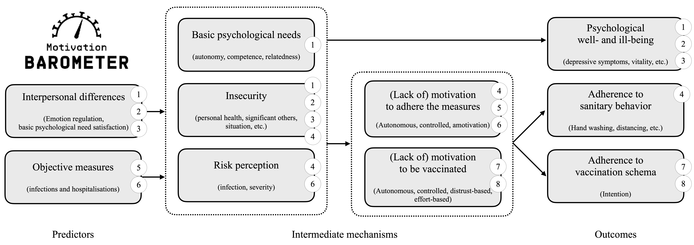
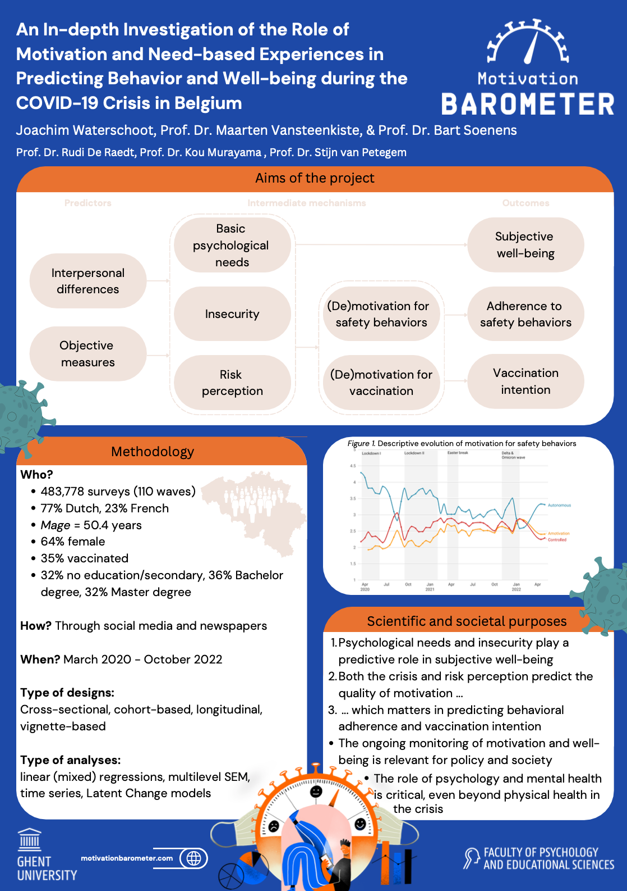

<style type="text/css">
<!-- body{ -->
<!--   font-size: 10pt; -->
<!-- } -->
p.comment {
background-color: #DBDBDB;
padding: 10px;
border: 1px solid black;
margin-left: 25px;
border-radius: 5px;
font-style: italic;
}
div.blue { background-color:#e6f0ff; border-radius: 15px; padding: 20px;}
div.orange { background-color:#ffa366; border-radius: 5px; padding: 20px;}
div.yellow { background-color:#09bb9f; color: white; border-radius: 5px; padding: 20px;}
div.grey { background-color:#ebebeb; color: white; border-radius: 5px; padding: 20px;}
.btn {
    border-width: 0 0px 0px 0px;
    font-weight: normal;
    text-transform: ;
}
.btn-default {
    color: #2ecc71;
    background-color: #ffffff;
    border-color: #ffffff;
}
</style>

<style>
  .col2 {
    columns: 2 200px;         /* number of columns and width in pixels*/
    -webkit-columns: 2 200px; /* chrome, safari */
    -moz-columns: 2 200px;    /* firefox */
  }
  .col3 {
    columns: 3 100px;
    -webkit-columns: 3 100px;
    -moz-columns: 3 100px;
  }
</style>

<!-- setwd('/Users/joachimwaterschoot/Library/CloudStorage/OneDrive-UGent/watjoa.github.io') -->

<script>
   $(document).ready(function() {
     $head = $('#header');
     $head.prepend('')
   });
</script>

<br>

# Info
***

### Names and positions

* **PhD student:** Joachim Waterschoot 
* **Supervisors:** Prof. Dr. Maarten Vansteenkiste, Prof. Dr. Bart soenens
* **Doctoral Advisory Committee:** Prof. Dr. Stijn Van Petegem, Prof. Dr. Kou Murayama, Prof. Dr. Rudi De Raedt
* **Examination Committee:** ?, ?, ?, ? (invited)

### Schedule

```{r echo=FALSE, warning=FALSE,message = FALSE,results="asis"}
Rnew <- readxl::read_excel('kalender.xlsx')
library(flextable)
  Rnew <- as.data.frame(Rnew)
  Rnew <- flextable(Rnew)
  Rnew <- theme_zebra(Rnew)
  Rnew <- autofit(Rnew)
  Rnew
```

<br>
<br>

# Content 
***

### General abstract

<div class = "blue">
<div class = "row">

From the Spring of 2020 on, the COVID-19 pandemic made countries to implement a set of safety measures to avoid the implosion of their national healthcare system. People were asked to stay at home, to keep physical distance and to minimize social contact. Because of the health-threatening nature of the crisis and the intrusive impact of the measures on people’s daily lives, it was clear that this crisis would not just be a medical but also a psychological one, with individuals’ psychological well-being and motivation to adhere the measures being central themes. In the current PhD, I focus on both themes, thereby addressing several key issues in the framework of the Motivation Barometer, a national, large-scale research project that was launched in March 2020 with the aim of monitoring individuals’ motivation, behavior, vaccination attitudes, and well-being during the Belgian crisis. 

The COVID-19 crisis threatened people’s mental health by affecting people’s basic psychological needs for autonomy, competence, and relatedness. Therefore, in *Chapter 1* I examined the relationship between these psychological needs and people’s subjective well-being in the light of fluctuating levels of subjective insecurity and varying hospitalizations throughout the pandemic. Noticeably, there was a large amount of heterogeneity in the population in how people dealt with the situation, opening the question whether people’s emotion regulation styles can account for variation in individuals’ subjective well-being. The role of emotional regulation style was addressed through a person-centered (*Chapter 2*) and a longitudinal approach (*Chapter 3*). The crisis also required a strong behavioral commitment from the population. For instance, people were asked to celebrate Christmas holidays in 2020 in their inner social circle. In *Chapter 4*, I present findings of a vignette study including different social scenarios that were rated by participants in terms of their potential effects on people’s well-being during Christmas holidays. People’s motivation to adhere to the measures was considered as a moderator of these offered scenarios. Motivational dynamics not only played a key role during Christmas times, but throughout the pandemic. While *Chapter 5* focuses on the dynamic interplay between hospitalizations and motivation across time, the role of people’s risk perception as a motivational resource was considered in *Chapter 6*. The development of vaccines opened a new phase in the crisis, showing strong interindividual differences in people’s willingness to get the vaccine. Across the first vaccine campaign, *Chapter 7* examines the longitudinal interplay between people’s type of motivation and vaccination intentions. Next, we examined to what extent people’s motivation for their first dose would still have a predictive value for their intention to have a booster dose or even an annual dose in *Chapter 8*.

The global aim of the current dissertation is to provide an evidence-based overview of key findings identified within the Motivation Barometer project.  The lessons learned from this project may appear useful when facing other societal and worldwide crises, like climate change. 

</div>
</div>

<br>

<center>
*Theoretical figure*

</center>

<br>

### Poster


<div class = "row">
<div class = "col-md-4">
</div>
<div class = "col-md-4">
<center>

<br>
[Download full size <i class="fa fa-file-pdf-o" aria-hidden="true"></i>](download/other_docs/PhD poster.pdf)

</center>
</div>
<div class = "col-md-4">
</div>
</div>


<br>

# Chapter overview {.tabset .tabset-fade .tabset-pills}
***

## PART I

### Part I: Interindividual differences in the impact of COVID-19 on people’s mental health

<br>
<div class = "row">
<div class = "col-md-10">
1\. Waterschoot, J., Morbée, S., Soenens, B., Brisbois, M., Klein, O., Luminet, O., Schmitz, M., Van den Bergh, O., Van Oost, P., Raemdonck, E., Yzerbyt, V., & Vansteenkiste, M. **The Role of Basic Psychological Needs for Well-being during Pandemic Times.** *In progress.*
</div>
<div class = "col-md-2">
*In progress*
<!-- [Download <i class="fa fa-file-pdf-o" aria-hidden="true"></i>](download/sciencs/studies/6bf4ef7e-691e-4512-8b9d-a71ae5f8700e.pdf)<br> -->
<!-- [Link <i class="fa fa-external-link" aria-hidden="true"></i>](https://link.springer.com/article/10.1007/s12144-021-02623-5) -->
</div>
</div>

<div class = "blue">
<div class = "row">
*Objectives.* The COVID-19 pandemic challenged people’s mental health importantly. Intrusive measures (i.e., lockdown, avoidance of physical contact), a substantial health risk (i.e., fluctuating virus spreading) and economic uncertainty entailed a period of high insecurity and potential loss. In this study, we examined how basic psychological need satisfaction was impacted during the pandemic and how it affected well-being, doing this in the light of experienced insecurity. 

*Methods.* Using data from a longitudinal sample and from multiple subsequent cohorts, we assessed daily psychological need satisfaction and its association with indicators of well-being during the pandemic from both an objective and subjective perspective. In study 1, a sample of 591 participants (Mage= 43.08) completed online questionnaires across the first 10 weeks of the pandemic. In study 2, we collected data of a large sample of 273,722 participants (Mage= 48.03) across 788 days. 

*Results.* Findings across both studies show robust associations between psychological need satisfaction and indicators of well-being, with higher need satisfaction buffering feelings of insecurity, an effect that was found on both the between-person and between-days level and that was found even when including hospitalizations as an objective indicator of insecurity. 

*Conclusion.* Even in highly insecure times of the COVID-19 pandemic, the current findings demonstrate the robust effects of the psychological need satisfaction in people’s well-being.

</div>
</div>

<br>
<br>
<div class = "row">
<div class = "col-md-10">
2\. Waterschoot, J., Morbée, S., Vermote, B. et al. (2022). **Emotion regulation in times of COVID-19: A person- centered approach based on self-determination theory.** *Current Psychology,* 1-15. 
</div>
<div class = "col-md-2">
[Download <i class="fa fa-file-pdf-o" aria-hidden="true"></i>](download/sciencs/studies/6bf4ef7e-691e-4512-8b9d-a71ae5f8700e.pdf)<br>
[Link <i class="fa fa-external-link" aria-hidden="true"></i>](https://link.springer.com/article/10.1007/s12144-021-02623-5)
</div>
</div>

<div class = "blue">
<div class = "row">
Although the COVID-19 crisis is a worldwide threat to individuals’ physical health and psychological well-being, not all people are equally susceptible to increased ill-being. One potentially important factor in individuals’ vulnerability (versus resilience) to ill-being in the face of stress is emotion regulation. On the basis of Self-Determination Theory, this study examined the role of three emotion regulation styles in individuals’ mental health during the COVID-19 crisis, that is, integration, suppression, and dysregulation. Participants were 6584 adults (77 % female, Mage = 45.16 years) who filled out well-validated measures of emotion regulation, depression, anxiety, life satisfaction, and sleep quality. To examine naturally occurring combinations of emotion regulation strategies, hierarchical k-means clustering was performed, yielding 3 profiles: (a) low scores on all strategies (indicating rather low overall levels of worry; 27%), (b) high scores on integration only (41%), and (c) high scores on suppression and dysregulation (33%). Participants in the profiles scoring high on suppression and dysregulation displayed a less favorable pattern of outcomes (high ill-being, low life satisfaction, and poorer sleep quality) compared to the other two groups. Between-cluster differences remained significant even when taking into account the corona-related worries experienced by people. Overall, the findings underscore the important role of emotion regulation in individuals’ mental health during mentally challenging periods such as the COVID-19 crisis. Practical implications and directions for future research are discussed.
</div>
</div>

<br>
<br>
<div class = "row">
<div class = "col-md-10">
3\. Brenning, K., Waterschoot, J., Dieleman, L., Morbée, S., Vermote, B., Soenens, B., Van der Kaap-Deeder, J., van den Bogaard, D., & Vansteenkiste, M. (2022). **Maladaptive Emotion Regulation as a Vulnerability Factor during the COVID-19 Pandemic: A 10-Wave Longitudinal Study.** *Stress & Health.*
</div>
<div class = "col-md-2">
[Download <i class="fa fa-file-pdf-o" aria-hidden="true"></i>](download/sciencs/studies/StressHealthER.pdf)<br>
[Link <i class="fa fa-external-link" aria-hidden="true"></i>](https://onlinelibrary.wiley.com/doi/abs/10.1002/smi.3204 )
</div>
</div>

<div class = "blue">
<div class = "row">
The COVID-19 pandemic elicited a lot of concerns among citizens, thereby potentially compromising their well-being. This study sought to examine the role of individuals’ emotion regulation styles (i.e., emotional dysregulation, emotional suppression, and emotional integration) in handling these concerns and their experiences of well-being (i.e., satisfaction with life and sleep quality) and ill-being (i.e., anxiety and depressive symptoms). The study had a unique 10-wave longitudinal design (N = 986; Mage = 41.28; 76% female) and was conducted during the outbreak of the pandemic in March-May 2020. Multilevel analyses showed, first, that weekly variation in COVID-19 related concerns related negatively to weekly variation in well-being and positively to weekly variation in ill-being. Second, at the between-person level, emotional dysregulation and suppression related positively to between-person vulnerability in ill-being and lower well-being (across all waves). Third, between-person differences in emotional dysregulation amplified the strength of the within-person association between concerns and depressive complaints and lowered life satisfaction. Unexpectedly, integrative emotion regulation amplified the strength of the within-person association between concerns and anxiety. The discussion focuses on the critical role of emotion regulation in handling the uncertainty elicited by the pandemic and provides directions for further research.
</div>
</div>

<br>
<br>


## PART II

### Part II: Motivation and Adherence to Safety Behaviors

<br>
<div class = "row">
<div class = "col-md-10">
4\. Waterschoot, J., Morbée, S., Van den Bergh, O., & Vansteenkiste, M. (2022). **Merry Christmas and a ‘Healthy’ New Year: Assessing people’s Expectations regarding Christmas Gathering in Pandemic Times.** *European Journal of Health Psychology.* 
</div>
<div class = "col-md-2">
[Download <i class="fa fa-file-pdf-o" aria-hidden="true"></i>](download/sciencs/studies/2512-8442_a000114.pdf)<br>
[Link <i class="fa fa-external-link" aria-hidden="true"></i>](https://doi.org/10.1027/2512-8442/a000114)
</div>
</div>

<div class = "blue">
<div class = "row">
*Background.* In November 2020, many European governments imposed severe limitations on social contacts and festive gatherings to avoid a further outbreak of the COVID-19 pandemic. 
Aims. When it was still unclear whether Christmas gatherings would be allowed, the present vignette study was conducted to evaluate four hypothetical scenarios varying in restrictiveness (i.e., 1, 2, 4, or an unlimited number of visitors). 

*Method.* In total, 5756 Belgian participants (65.7% female; Mage = 45.6, range: 18-89) evaluated each scenario in terms of the perceived strictness, probability of adherence, and expected psychological advantages (i.e., autonomy, relatedness, pleasure) and disadvantages (i.e., concerns).

*Results.* Evidence for a curvilinear pattern was found, such that the expected psychological benefits increased with an increasing number of allowed visitors till 4, with this effect being reversed in case of an unlimited gathering. Yet, these main effects were qualified: older adults, those living together, and those scoring high on risk perception and autonomous motivation to adhere to the corona measures expected the more restrictive scenarios to be equally beneficial compared to the more relaxed scenarios. 

*Limitations.* Limitations are self-selection of the sample, no counterbalancing of the scenarios and the vignette-based methodology. 

*Conclusion.* The present findings suggest that people’s risk perception and autonomous motivation are key to secure and stimulate the acceptance of life-restricting measures.
</div>
</div>

<br>
<br>
<div class = "row">
<div class = "col-md-10">
5\. Waterschoot, J.,  Morbée, S., Yzerbyt, V., Van Oost, P., Klein, O., Luminet, O., Schmitz, M., Van den Bergh, O., & Vansteenkiste, M. **‘Dances with Viruses’’: The Association between Motivation and Epidemiology of COVID- 19.** *Submitted to European Journal of Epidemiology and Global Health.*
</div>
<div class = "col-md-2">
[Download <i class="fa fa-file-pdf-o" aria-hidden="true"></i>](download/sciencs/studies/EPGH-D-22-00151.pdf)<br>
<!-- [Link <i class="fa fa-external-link" aria-hidden="true"></i>](https://psycnet.apa.org/record/2022-98394-001) -->
</div>
</div>

<div class = "blue">
<div class = "row">
*Background.* To manage the COVID-19 pandemic, governments imposed invasive behavioral measures to limit virus circulation. Because adherence to such measures depends on people’s motivation to comply, the current study investigated the association between daily variation in people’s motivation to adhere to behavioral measures with growth rates of infections and hospitalizations in [blinded for review].

*Methods.* The data were collected during the first 12 months of the COVID-19 crisis (N = 183,766; 7.2% missing days; 0% vaccinated; Mage = 50.41; 68.2% female). 

*Results.* Controlling for a set of pandemic-related covariates and accounting for a lag between infections and hospitalization numbers, a cross-lagged structural equation model revealed significant indirect associations, with increasing infection rates resulting in higher levels of motivation on the same day which, in turn, related to decreasing infections and hospitalizations 43 and 50 days later, respectively. Furthermore, the growth rate in hospitalization numbers was negatively related to motivation and infections after 43 days, which indicated that a reduction of hospitalizations was followed by increasing infection rates and more motivation to comply to the measures after 43 days.

*Interpretation.* These associations highlight the role of motivation as a critical target to develop a preventive policy to change the epidemiological course.
</div>
</div>


<br>
<br>
<div class = "row">
<div class = "col-md-10">
6\. Waterschoot, J., Vansteenkiste, M., Brisbois, M., Klein, O., Luminet, O., Morbée, S., Raemdonck, E., Schmitz, M., Van Oost, P., Yzerbyt, V. & Van den Bergh, O. **The Role of Risk Perception in the Prediction of Autonomous Motivation, Behavioral Adherence and Vaccination Intentions during the COVID-19 Pandemic.** *Submitted to BMC Public Health.*
</div>
<div class = "col-md-2">
[Download <i class="fa fa-file-pdf-o" aria-hidden="true"></i>](download/sciencs/studies/InPress_WaterschootVansteenkisteEtAl_RiskPerception.pdf)<br>
<!-- [Link <i class="fa fa-external-link" aria-hidden="true"></i>](https://psycnet.apa.org/record/2022-98394-001) -->
</div>
</div>

<div class = "blue">
<div class = "row">
*Background.* People’s perceived risk to be infected and to have severe illness has been thought as a motivational source of adherence to behavioral measures during the COVID-19 crisis.

*Methods.* We used online self-reported data, spanning 20 months of the COVID-19 crisis in [blinded] (n = 241,275; 34% vaccinated; July 2020 - March 2022).

*Results.* The findings demonstrate, especially among vaccinated persons, that people’s perceived severity was more prominent than perceived probability for infection, up until Omicron emerged. At both the between-persons and between-day levels, perceived severity was the most strongly related to autonomous motivation, a pattern that was less pronounced for unvaccinated people towards the end of the crisis. 

*Conclusions.* These findings show that variation in risk perceptions largely accounts for the variation in both between-individuals’ and day-to-day variation in motivation to adhere to the measures, thereby showing a sensitivity to the characteristics of the variants of the virus and the role of one’s vaccination status.
</div>
</div>
<br>
<br>

## PART III

### Part III: Motivation and Vaccination Intention

<br>
<div class = "row">
<div class = "col-md-10">
7\. Waterschoot, J., Van Oost, P., Schmitz, M., Luminet, O., Klein, O., Morbée, S., Soenens, B., Van den Berg, O., Yzerbyt, V., & Vansteenkiste. **How Do Vaccination Intentions Change over Time? The Role of Motivational Growth.** *Health Psychology* 
</div>
<div class = "col-md-2">
[Download <i class="fa fa-file-pdf-o" aria-hidden="true"></i>](download/sciencs/studies/2022-98394-001.pdf)<br>
[Link <i class="fa fa-external-link" aria-hidden="true"></i>](https://psycnet.apa.org/record/2022-98394-001)
</div>
</div>

<div class = "blue">
<div class = "row">
*Objective.* Across nationwide rollout of COVID-19 vaccination, people in Belgium differed widely in their vaccination intention. In the present study, we examined (a) how people's vaccination intentions changed during the vaccination rollout and (b) whether changes in motivation (i.e., autonomous, controlled, and distrust-based (a)motivation) predicted changes in vaccination intention, thereby taking into account people's vaccination intention at baseline. 

*Method.* Using 4 subsamples of participants who were vaccinated at different time points (ntotal = 10,799) between December 2020 and June 2021; we used latent change modeling and latent growth curve modeling to examine the associations among initial levels and changes in vaccination motivation and vaccination intention. 

*Results.* Across subsamples, changes in vaccination intention were found to be qualified by changes in motivation. An increase in autonomous motivation was related to a positive shift in vaccination intention, while an increase in both controlled motivation and distrust-based amotivation was related to a negative shift in vaccination intention. Moreover, autonomous motivation predicted especially an increase in vaccination intention among those initially low in vaccination intention, whereas an increase in either controlled motivation or distrust-based amotivation especially predicted a decrease in vaccination intention among those initially high in vaccination intention. 

*Conclusions.* Findings suggest that a growing sense of ownership and a reduction in distrust is critical for individuals to develop a stronger intention to get vaccinated, particularly when people had initially low vaccination intentions. We discuss conceptual, methodological, and practical implications.
</div>
</div>

<br>
<br>
<div class = "row">
<div class = "col-md-10">
8\. Waterschoot, J., Van Oost, P., Vansteenkiste, M., Bribois, M., Schmitz, M., Morbée, S., Klein, O., Luminet, O., Van den Bergh, O., Raemdonck, E., & Yzerbyt, V. **Who is Motivated to Accepted a Booster and Annual Dose? A Dimensional and Person-Centered Approach.** *Submitted to Journal of Applied Psychology: Health and Well-being*
</div>
<div class = "col-md-2">
[Download <i class="fa fa-file-pdf-o" aria-hidden="true"></i>](download/sciencs/studies/third dose manuscript blinded_final_MV_VY_JW PV_MV_JW.pdf)<br>
<!-- [Link <i class="fa fa-external-link" aria-hidden="true"></i>](https://psycnet.apa.org/record/2022-98394-001) -->
</div>
</div>

<div class = "blue">
<div class = "row">
The transmissibility of new COVID-19 variants and decreasing efficacy of vaccines led authorities to recommend a booster, and even an annual dose. However, people’s willingness to accept new doses varied considerably. Using two independent longitudinal samples of 4,596 (*Mage* = 53.6) and 514 (*Mage* = 55.9) vaccinated participants, we examined how people’s (lack of) vaccination motivation for their first dose was associated with their intention to get a booster (Sample 1) and an annual dose (Sample 2) several months later (Aim 1). We also aimed to capture the impact of the motivational heterogeneity by capitalizing on participants’ different motivational profiles as we collected them at baseline (Aim 2). Across both samples, autonomous motivation, controlled motivation and distrust-based amotivation were related to, respectively, higher, lower, and even lower booster and annual dose intention. A two-step clustering procedure revealed five profiles, with those characterized by high autonomous motivation (i.e., Good Quality and High Quantity profiles) reporting the highest scores for vaccination intention and with profiles characterized by high distrust (i.e., Controlled/distrust-based and overall Amotivated profiles) having the lowest vaccination intention. These results stress the critical need to support citizens’ volitional endorsement of vaccination to harvest long-term benefits with respect to COVID-19.
</div>
</div>


